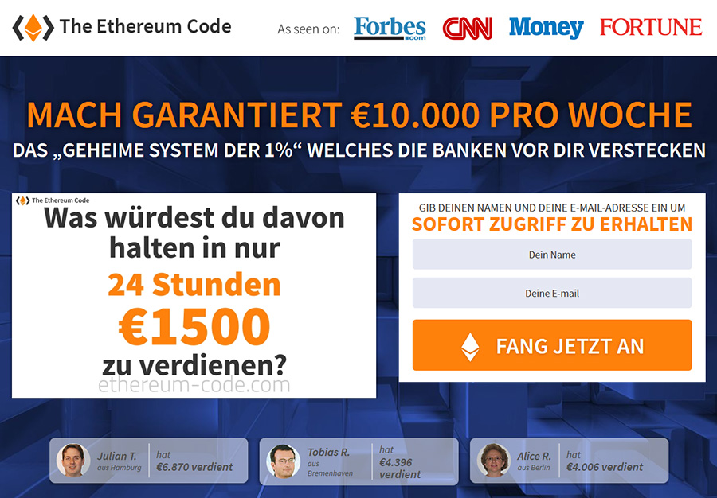
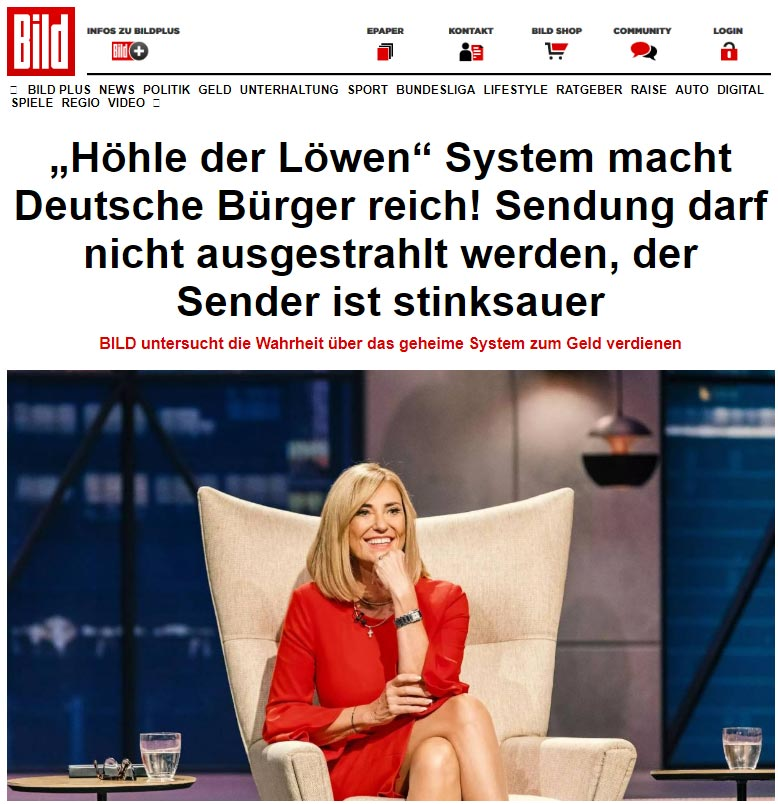
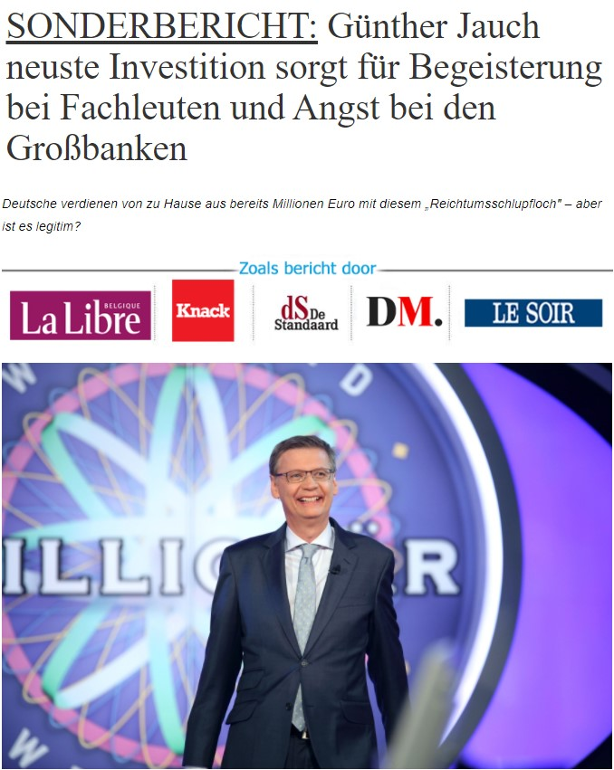
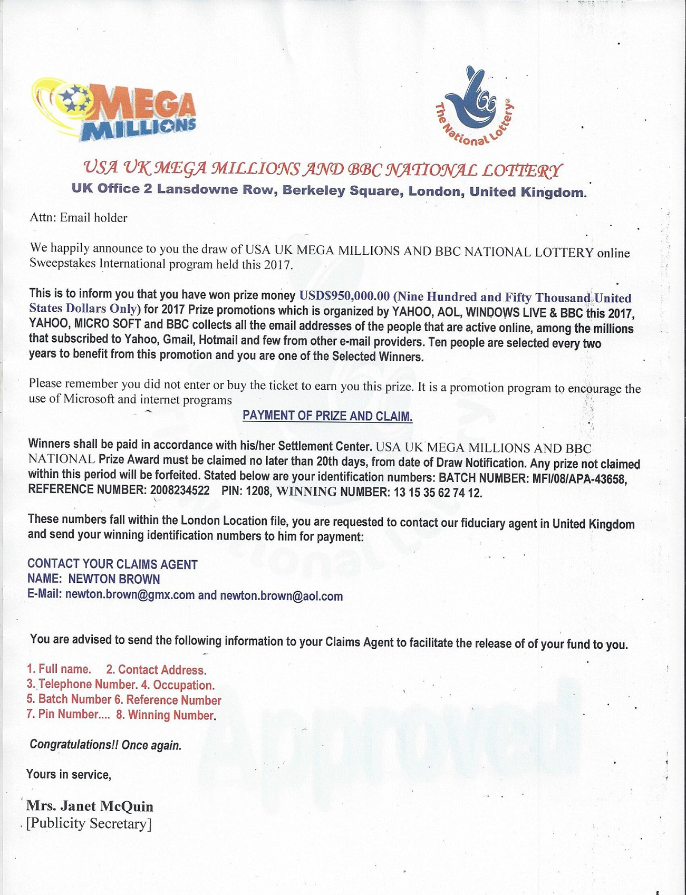
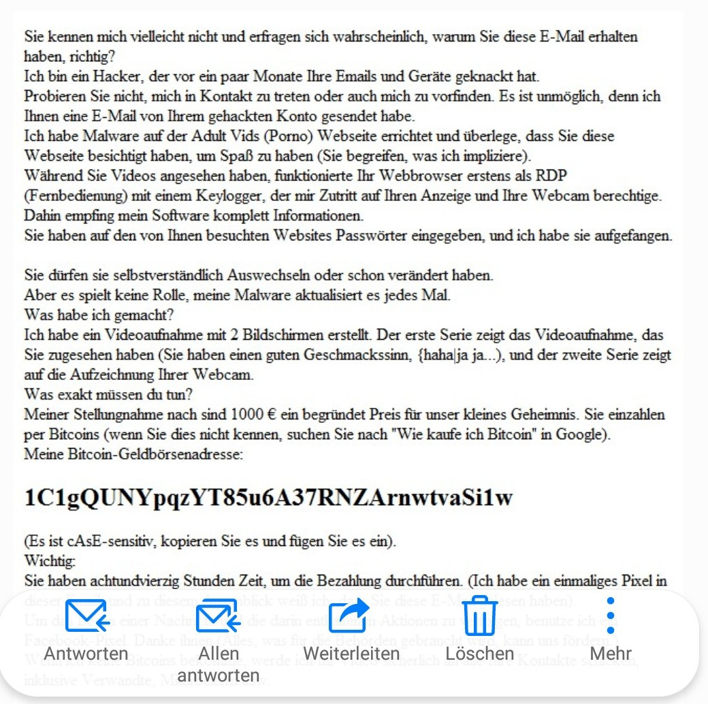
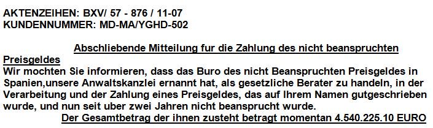

# Spam

An assorted collection of email spam messages, should you ever be in need of one.

## Investition

Ich möchte einen ernsthaften und sensiblen Geschäftsvorschlag mit Ihnen über eine angemessene Menge
an Investitionskapital besprechen.

Aufgrund der sensiblen Natur meiner Geschäftspläne fordere ich, dass alle Kommunikation über unsere
privaten E-Mail-Adressen erfolgt, auf die nur aus Sicherheitsgründen von uns zugegriffen werden
kann. Ich gebe Ihnen eine ausführlichere Information, wenn Sie Ihre Bereitschaft zur Arbeit mit mir
angeben. Meine E-Mail ist: xxx@yyy.com

Freundliche Grüße,

Li

## Später ausländischer Kunde

Grüße,

Ich bin Dr. Richard Scott, Managing Director Audit Department der Credit Suisse Bank hier in
London. Ich sah Ihren Kontakt während meiner privaten Suche in der Informations-Center und ich habe
eine tief glaube, dass Sie sehr ehrlich, engagiert und fähig zu unterstützen mich in diesem Geschäft
Venture.  Ich wende mich an Sie, um als die nächste der Angehörigen/will Begünstigten zu einem
späten ausländischen Kunden meiner Bank, so dass die Gesamtsumme von £15.800.000,00 GBP (15,8
Millionen Great British Pfund Sterling) wird freigegeben und bezahlt Ihnen als Empfänger auf den
verstorbenen.  Am Ende dieser Transaktion werden Sie 45% der gesamten Erbschaft nehmen und ich nehme
55%.

Ich werde Ihnen alle nötigen Informationen, Unterlagen und Nachweise zur rechtlichen Sicherung der
Forderung aus den verschiedenen Stellen, die für die reibungslose Übertragung dieses Fonds auf einen
ihrer Konten als der wahre Begünstigte. Wenn dieser Vorschlag Sie erfüllt, wenden Sie sich bitte an
mich mit folgenden Informationen: Ihre vollständigen Namen, Telefon/Fax/Handynummer, Kontaktadresse,
Alter/Geschlecht, Beruf und Nationalität.

Ich erwarte Ihre dringende Antwort, damit wir fortfahren.  Bitte beantworten Sie diese E-Mail:
(xxx@yyy.com)

Alles Gute
Dr. Richard Scott. 

## Plane crash

Greetings to you and your family, I am Mr. Michael Cwele, Manager in charge of the First National
Bank Saves and Vaults and F N B Security & Financial Services South Africa, I need your assistance
in transferring the sum of ($4,900.000.00M) into your account in your country, this money belongs to
one of our foreign customer by name, Mr. Alan Williams who died along with his entire family in a
plane crash some years ago; you can view the link below for more details:

http://www.telegraph.co.uk/news/worldnews/africaandindianocean/tanzania/1501084/Tycoon-dies-with-family-in-Tanzania-safari-plane-crash.html 

I am will to offer you 30% of this money, in respect of concluding the business with me and 70%
would be for me and my colleagues, once the fund is transferred, I will visit your country for
disbursement according to the percentage indicated, reply to the email below if interested and I
will furnished you with details information as soon as I get your response.

May God bless you and your family.

For the Department.

Michael Cwele

(HEAD OF SAVES AND VAULTS FUNDS)

+nnnnnnnnn

xxx@yyy.com

NOTE: THERE IS STILL 10,000,000.00USD TO BE MOVED OUT OF THE SECURITY COMPANY,THAT IS IF THE FIRST
DEAL GOES WELL, I WILL MOVE THE REST THROUGH YOU. THE TOTAL MONEY IS 14,900,000,00USD, BUT LET’S
TRANSFER 4,900,000.00USD FIRST.

## Freundlicher Bitcoin-Hacker

Hallo!

Ich bin ein Hacker, dem es gelungen ist, die volle Kontrolle über Ihr Gerät zu erlangen.  Ich muss
Ihnen sagen, dass ich die volle Kontrolle über all Ihre persönlichen Daten, Kontakte und Ihre
gesamte Korrespondenz habe.  Außerdem habe ich die Aufzeichnung, die zeigt, wie Sie sich selbst
befriedigen, auf der linken Seite des Bildschirms abgeschlossen, und auf der rechten Seite sehen Sie
das Video, das Sie sich angesehen haben.
 
Mit einem einzigen Klick kann ich dieses Video an alle Ihre Kontakte in der Post und in den sozialen Medien senden.
Ich kann Ihren Ruf und Ihr Leben ruinieren.

Ich kann auch den Zugang zu all Ihren E-Mails und Boten veröffentlichen, die Sie benutzen.

Wenn Sie sich fragen, was für schlimme Dinge getan werden können, denken Sie an all Ihre Freunde,
Familienmitglieder und Kollegen und wie sie reagieren werden, wenn sie Sie in dem von mir
bearbeiteten Video masturbieren sehen.

Wenn Sie dies verhindern möchten, überweisen Sie 1000 $ in Ihre BTC-Brieftasche:
nnnnnnnnnnnnnnnnnnnnnnnnnnn (wenn Sie nicht wissen, wie man das macht, dann schreiben Sie auf
Google: "Bitcoin kaufen").

Die Malware, mit der ich mich bei Ihrem Gerät angemeldet habe, ist so mächtig, dass Ihr
Antivirusprogramm sie nicht stoppen konnte, und es gibt keine Anzeichen dafür, dass sie noch in
Ihrem System vorhanden ist.

Sobald ich die Zahlung erhalten habe, werde ich das Video löschen und Sie werden nie wieder von mir
hören.  Ich gebe Ihnen 50 Stunden (mehr als zwei Tage) zur Bezahlung.  Ich habe einen Hinweis, diese
E-Mail zu lesen, und der Timer wird ausgelöst, wenn Sie diese E-Mail sehen.

Versuchen Sie nicht, mir zu antworten. Es macht keinen Sinn (die Absenderadresse wird automatisch
generiert).  Irgendwo eine Beschwerde einzureichen macht keinen Sinn, da diese E-Mail nicht
zurückverfolgt werden kann, ebenso wenig wie meine Bitcoin-Adresse.  Ich mache keine Fehler.

## Derselbe nochmal

Grüß Gott!

Ich habe beobachtet Ihr Gerät im Netz seit langer Zeit und habe es geknackt. Es war einfach für
mich, weil ich mich damit schon lange beschäftige.

Wann Sie besuchten die pornografische Webseite ich habe angesteckt Ihr Computer mit dem Virus, der
sicherte mir vollständigen Zugang zu Ihr Gerät, inklusive die Kamera, das Mikrofon, die Anrufe, die
Messenger, zu all dem was geschieht am Bildschirm, zum Telefonbuch, zu Passworten aller sozialer
Netzwerken und weiteres.

Um das Handeln meines Virus zu verstecken, ich habe gebastelt ein sonder-Driver, updated alle einige
Stunden und daher vollständig unnachweisbar.

Ich habe herunterladen das Video aus Ihrem Bildschirm und Ihrer Kamera und habe geschnitten ein
Video auf dem in einem Teil des Bildschirms Sie masturbieren und der andere Teil zeigt ein
Porno-Video die Sie gleichzeitig schauten.

Ich kann schicken jederzeit allerlei Daten aus Ihrem Gerät ins Internet oder an alle jene, die
stehen an Ihrer Kontaktliste, an den Messengern oder in sozialen Netzwerken.

Außerdem, ich kann bereitstellen den Zugang zu Ihren Messengern, sozialen Netzwerken oder zum E-Mail
jedem beliebigen Menschen.

Wenn Sie dies vermeiden wollen tun Sie folgendes-

Überweisen Sie auf meine Bitcoin-Geldbörse 1100 amerikanische Dollars.

Adresse meiner Bitcoin-Geldbörse : nnnnnnnnnnnnnnnnnnnnnnnnnn

Sie haben 48 Stunden zur Überweisung. Andernfalls ich werde alles Obenstehende dürchfuhren.  Der
Zeitgeber hat gestartet automatisch sofort nachdem Sie den Brief eröffnet hatten.
Die Meldung über Eröffnung dieses Briefs bekomme ich auch automatisch.  

Wenn Sie wissen nicht wie man das Geld überweist und was ist Bitcoin, schreiben Sie die Anfrage in
Google „Bitcoin kaufen“.

Sofort nach Erhalt der notwendigen Summe das System wird mich automatisch benachrichtigen und wird
anbieten aus meinen Servern alle von Ihnen erhaltene Daten zu löschen.

Und ich werde das Löschen bestätigen.

Beschwerden Sie sich nirgendwo – meine Geldbörse kann nicht nachgefolgt werden und der E-Mail aus
dem der Brief wurde geschickt wird erstellt automatisch und es ist sinnlos mich etwas zu schreiben.

Sollten Sie diesen Brief irgendjemandem teilen wollen, das System wird die Anfrage auf die Server
automatisch schicken und diese werden Ihre Daten in sozialen Netzwerken veröffentlichen. Außerdem,
der Wechsel von Passworten in sozialen Netzwerken, von E-Mail und am Gerät wird Sie nicht helfen,
weil alle Daten sind bereits herunterladen am Cluster meiner Server.

Ich wünsche Sie viel Glück und tun Sie keinen Blödsinn.

## Invite für die Illuminaten

Grüße aus dem Elite-Imperium der Illuminaten. Bringen Sie die Armen, Bedürftigen und Talente ins
Rampenlicht von Ruhm, Reichtum, Macht und Sicherheit, werden Sie in Ihrem Geschäft, Ihrer
politischen Rasse anerkannt, steigen Sie bei allem, was Sie tun, an die Spitze, bleiben Sie geistig
und körperlich geschützt! All dies erreichen Sie im Handumdrehen, wenn Sie in das große
Illuminati-Reich eingeweiht werden. Sobald Sie in das Illuminati-Reich eingeweiht sind, erhalten Sie
zahlreiche Vorteile und Belohnungen. Sind Sie damit einverstanden, Mitglied der neuen Weltordnung der
Illuminaten zu sein? Antworten Sie einfach mit JA! über die Rekrutierungs-E-Mail: 
xxx@yyy.com und wir werden uns in Kürze mit Ihnen in Verbindung setzen. 

Hinweis: Diese E-Mail-Nachricht wurde ausschließlich zum Zweck unseres Rekrutierungsprogramms
erstellt, das nächsten Monat endet. Dieses Angebot gilt nur für Einzelpersonen. Wenn Sie es nicht
ernst meinen, dem Illuminati-Imperium beizutreten, sollten Sie uns überhaupt nicht kontaktieren
. Dies liegt daran, dass Untreue hier in unserer Organisation in hohem Maße nicht toleriert wird.
Stimmen Sie zu, Mitglied der neuen Weltordnung der Illuminaten zu sein? Falls ja!. Dann antworten
Sie uns bitte auf unserer direkten Rekrutierungs-E-Mail nur an: xxx@yyy.com

Bitte beachten Sie: Bitte stellen Sie sicher, dass alle Ihre Antworten direkt an die oben angegebene
E-Mail-Adresse gesendet werden: xxx@yyy.com

Zum Weitere Anweisungen zu unserem Mitgliedschaftsprozess.  Hinweis: Einige E-Mail-Anbieter legen
offizielle Illuminati-Nachrichten fälschlicherweise in ihrem Spam- / Junk-Ordner oder
Promotion-Ordner ab. Dies kann unsere Antworten auf Ihre E-Mails umleiten und ausschließen.

Die Illuminati.

## Vorteilhafter Vorschlag

Hallo,

Aufgrund unerwarteter Umstände bin ich verpflichtet, mich direkt mit Ihnen in Verbindung zu setzen,
um zu sehen, ob wir zusammenarbeiten können. Ich habe einen Vorschlag im Wert von 38,5 Millionen
Pfund, der für uns beide vorteilhaft sein wird. Wenn es nach etwas anhört, das Sie interessieren
könnte, kontaktieren Sie mich bitte so bald wie möglich und ich werde Ihnen alle Informationen
senden.

Mit freundlichen Grüßen,

Ben Bomann
Probate

## IWF-Solidaritätsfond

Herzliche Glückwünsche!

Ich möchte Sie darüber informieren, dass Sie vom IWF Solidaritätshilfefonds im Rahmen des
Solidaritätsreaktionsfonds einen Betrag von 500.000 EURO (fünfhunderttausend Euro) erhalten haben,
um kleinen und mittleren Unternehmen zu helfen, die von der Covid-19-Pandemie betroffen sind als
Beitrag zum Covid-19 Solidaritätsreaktionsfonds unter der Leitung der Stiftung der Vereinten
Nationen und der Weltbank. Die Begünstigten wurden über soziale Medien und E-Mail-Datenbanken
ausgewählt. Ihr Referenzcode lautet COVID-19/RELIEF0006-13-2021-1061/UN-IMF-009402.

Um Ihr vergebenes Geld zu beanspruchen, senden Sie bitte Ihre Referenznummer, Ihre persönlichen
Daten, Unternehmensdaten, die Anzahl der Mitarbeiter, die gescannte Kopie Ihres internationalen
Passes / Ihrer nationalen Identität und Ihren Fotopass an die E-Mail-Adresse der Zahlungsabteilung:
xxx@yyy.com. Beachten Sie, dass das Geld über unsere Bank direkt auf Ihr
Bankkonto überwiesen wird. Bitte geben Sie Ihre Bankkontodaten an, um das Geld zu überweisen. Einer
unserer Zahlungsbeauftragten wird sich umgehend mit Ihnen in Verbindung setzen und die sofortige
Auszahlung Ihres Geldes über unsere Korrespondenzbank (innerhalb von 24 Stunden) erleichtern.

Bitte halten Sie Ihre Auszahlungsreferenznummer geheim, da sich jeder als Sie ausgeben kann, um Ihr
Geld zu beanspruchen.

Sie haben 14 Tage Zeit, um Ihr Geld zu beanspruchen.

Wir freuen uns auf Ihre Antwort mit den erforderlichen Informationen per E-Mail:
xxx@yyy.com.

Grüße,
Andrew Gerard,
Direktor der Finanzabteilung
Covid-19-Solidaritätsteam
Adresse: 1900 Pennsylvania Ave., N.W.
Washington, DC 20431

## Selbstloser Lottogewinner

Lieber geliebter

Ich Cristy Davis, ich habe 70 Millionen Dollar im Power-Ball-Jackpot gewonnen. Aufgrund der
COVID-19-Pandemie habe ich beschlossen, 12 Millionen Dollar an alle zu spenden, die auf die eine
oder andere Weise vom Ausbruch betroffen waren. In diesem Sinne habe ich beschlossen, im Rahmen
meines Wohltätigkeitsprojekts zufällig 2,4 Millionen US-Dollar an 5 Personen zu spenden.

Informationen zur Überprüfung Ihrer Lotteriegewinne finden Sie in meinem Interview auf der folgenden
Website:

     https://www.youtube.com/watch?v=xxxxxxx

Nach dem Computer-Spin-Ball waren Ihr Name und Ihre E-Mail-Adresse zwischen 5 zufälligen E-Mails,
die mir von Google, Inc. als Website-Benutzer gesendet wurden. Damit ich diese Spende an Sie senden
kann, senden Sie mir bitte die folgenden Details.

Ganze Namen:
Telefonnummer:
Alter:
Adresse:
Besetzung:

Sobald ich diese Daten erhalten habe, werde ich Ihnen den Kurierscheck
ausstellen lassen.
Ich warte auf deine Antwort.

Grüße,
Cristy Davis

## Kreditfinanzierung

Guten Tag,
Hiermit möchten wir Sie darüber informieren, dass wir derzeit Privat- und Geschäftskredite von
100.000euro bis 5.000.000 Euro zu einem niedrigen Zinssatz von 0,5% bis 1% im Rahmen des
Coronavirus-Darlehensentlastungsprogramms anbieten.

Wir bieten Betriebskapital, Erweiterungs- / Renovierungsdarlehen, Immobiliendarlehen, Baudarlehen,
Schuldenkonsolidierung, Unternehmensrefinanzierungsdarlehen sowie kleine und große
Unternehmensdarlehen an. Für weitere Informationen kontaktieren Sie uns per E-Mail:
xxx@yyy.com. Beachten Sie, dass wir keine Sicherheiten benötigen und die Optionen für
die Rückzahlung zwischen 12 Monaten und 20 Jahren liegen.  Sobald wir Ihre Kreditanfrage erhalten
haben, senden wir Ihnen die Kreditbedingungen umgehend zu.  Sie müssen Ihre Kreditanfrage über diese
E-Mail senden: xxx@yyy.com

Grüße,
James Gregory
Geschäftsführer
Scotia Finance
46 King St W, Toronto, ON M5H 1H1

## Dringendes Darlehen

ROCK FUNDING FIRM
Hauptsitz - 10a Great Sutton Street London EC1V 0DU VEREINIGTES KÖNIGREICH
EMAIL-ADRESSE --- (xxx@gmail.com)
------------------------------ -------------------- ---------- --------
Willkommen bei ROCK FUNDING FIRM Wir vergeben Kredite im Bereich von
€1.000 bis €900.000.000 zu 2% Zinssatz
Wir bieten alle Arten von Darlehen unten -

* Projekt darlehen
* Persönliche Darlehen
* Schuldenkonsolidierungs darlehen
* Autokredite
* Geschäfts kredite
* Bildungs darlehen
* Hypotheken darlehen
* Refinanzierungs darlehen
* Wohnungsbau darlehen

Bitte bewerben Sie sich
Name .......................
Land......................
benötigte Kreditmenge ........
Telefonnummer.................

GRÜSSE
VERA RUSSELL
TELL .. +44 1204 nnn nnn
WHATSAPP .. + 44 1204 nnn nnn
FAX .. +1 705 nnn nnnn
www.xxx.yyy.com
ROCK FUNDING FIRM

Welcome to ROCK FUNDING FIRM We give out loans from the range of €1,000
to €900,000,000 at 2% interest rate 

## BITTE BEACHTEN!

Oficina De Abogados Lawyer Dr/Gustavo LM Larraz
Web:www.xxx.org/lawyer
E-mail : xxx@yyy.com
Tele/ +34 nnnnnn
Direcion: Calle de Diego de León 47
Madrid 28006 Espana
MENSCHENRECHT FONDS VERTEIDIGEN BÜRO/

Ich war versuchen Kontakt Sie für über zwei Wochen,
aber du hast nicht Antworten meine E-Mail. WARUM ?

übersetzte Kopie.
Bitte lesen Sie vorsichtig und verstehen/

Mein Name ist Dr.Gustavo Lopez y Larraz
Vom Menschen Richtig Mittel Freisetzung Büro.
Wir haben gute Nachrichten für Sie.
Ich haben Ihre Informationen, daher müssen wir bestätigen von Ihnen,
dass diese Kontat Ihnen gehört.

Ihre langjähriges Geld wurde von der freigegeben
International monetary Geldmittel Büro (IMF)
Nur Sie haben rechtmäßigen Zugang zu diesen Geldern
die auch vom Lotteriebüro der Europäischen Union genehmigt wurden.

Der Betrag ist derzeit € 1,980,500.00 Die weiteren Informationen
wird dir zugesandt sobald ich bestätigen dass
du die rechtmäßige Person, bist das besitzt das E-Mail-Addresse/Kontat

Senden Sie uns diese Informationen unten
Ich senden Ihnen die vollständigen Details und das Be.
Die Fonds befinden sich derzeit in der Bank.

Bitte bestätigen Sie Ihre Informationen erneut /
a) Vollständiger Name: __ __ _
b) DIREKTE E-MAIL-ADRESSE: _ _ _ _ _
C) ADRESSE & POSTCODE: _ _ _ _ _ _
D) TELE / MOBIL: ___ _ ___ _

Anmerkung: Mein Anliegen
Sobald Sie diese Fonde erhalten, von der Bank
Sie werden mich bezahlen, und Büro 25% von den Mitteln,

Freundliche Grüße

Dr.Gustavo Lopez-M.y Larraz
Delegation D-ME in der EU-Montenegro
Association parliament
Tele / +34 nnnnnnn
Kontakt E-Mail : xxx@yyy.com

©1995-2020 All Rights Reserved HG.org Legal Resources - HGExperts.com

## Vielen Dank von Andy

Schöne Grüße Ich bin Rechtsanwalt Andy Owen von einer Anwaltskanzlei . Ich komme ursprünglich aus
Großbritannien. Ich habe einen Geschäftsvorschlag, um einen guten Geschäftsplan anzubieten Ich
brauche einen ausländischen Partner, der mich unterstützt Geschäft mit möglichen und zuverlässigen
Investitionen in Ihre Land.

Es ist ein Erbschaftsfonds im Wert von £ 4.500.000,00 Millionen Pfund links in der UBS in der
Investmentbank London. Mein verstorbener Klient ist Staatsbürger Ihres Landes. Ich brauche deine
größte Hilfe, damit die Bank Ich werde Ihnen den Fonds als Verwandten freigeben. Ich habe alle
Dokumente in meiner Obhut, um mit dieser Forderung fortzufahren. Ich werde Ihnen weitere
Einzelheiten mitteilen, sobald ich Ihre positiven Antworten bestätige.

Vielen Dank Rechtsanwalt
Andy Owen

## Herzliche Glückwünsche von Oxfam

Ihre E-Mail hat Ihnen als Community die Summe von 2.000.000,00 €
eingebracht Spende von Oxfam Aid, für weitere Informationen
kontaktieren Sie uns mit Ihrem Qualifikationsnummer {OXG / 111/461
/BDB} so bald wie möglich.

Betriebsleiter
Für mehr Informationen
E-Mail: xxx@outlook.com

Bitte beachten Sie, dass dies an einem kleinen Netzwerk liegt, wenn
Sie diese E-Mail in Ihrem Spam finden.

## Glückwunsch von der UN

Glückwunsch,

Aufgrund der Corona-Virus-Pandemie haben die Vereinten Nationen beschlossen, so viele Menschen auf
der ganzen Welt mit jeweils 5.000.000 Euro zu belohnen.

Ihre E-Mail-Adresse gehört zu den glücklichen Gewinnern. Um Ihren Gewinnpreis zu erhalten,
kontaktieren Sie uns bitte unter xxx@yyy.org mit dem vollständigen Namen Land und Telefonnummer,
Beruf und monatlichem Einkommen.

Vereinte Nation

## Geschenk des Vermögen/Ball im Gehirnkäfig

Hallo oder Guten Abend, je nachdem, wann du mich gelesen hast.

Ich entschuldige mich für dieses Eindringen, mein Name ist Marguerite
Nada, geboren am 31. Mai 1938 aus Frankreich.

Es wird Ihnen ein wenig misstrauisch erscheinen, obwohl es wahr ist,
dass Sie mich nicht kennen und dass ich Sie nicht kenne.

Ich leide an Hirnkrebs, der sich in der Endphase befindet. Mein
behandelnder Arzt hat mir gerade mitgeteilt, dass meine Tage aufgrund
meines verschlechterten
Gesundheitszustands gezählt sind.

Laut dem, was der Arzt mir erklärt hat, setzt sich derzeit ein Ball in
meinem Gehirnkäfig ab.

Ich habe diese Krankheit seit mehr als 4 Jahren.
Ich bin Witwe und habe keine Kinder bekommen.

Ich habe vor, mein gesamtes Eigentum zu spenden.
Ich hätte fast mein Geschäft verkauft, einschließlich einer
Holzexportfirma hier in Frankreich, wo ich seit fast 15 Jahren lebe.
Derzeit habe ich auf meinem persönlichen Konto die Summe von 500.000
Euro, die ich für ein Bauprojekt aufbewahrt hatte.
Können Sie dieses Geschenk, das ich Ihnen anbiete, gut nutzen?

Ein Teil dieses Geldes wird an verschiedene Verbände, Hilfszentren,
Waisen und Obdachlose gespendet.

Bitte kontaktieren Sie mich so schnell wie möglich, wenn Sie meinem
Angebot direkt per E-Mail zustimmen, da ich diese E-Mail am häufigsten
konsultiere.

Möge der Friede und die Barmherzigkeit Gottes mit Ihnen sein.

Marguerite Nada

## Großzügige Spende

Hallo,

Sie haben eine Spende von 3.500.000,00 Euro von Bill Lawrence, einem Powerball-Lotteriegewinner, im Wert von 150 Millionen US-Dollar.

Ihre E-Mail-Adresse wurde nach dem Zufallsprinzip ausgewählt, um die 3.500.000,00 EUR zu erhalten, wenn Sie uns über die untenstehenden Details kontaktieren möchten.

Bitte kontaktieren Sie den Spender für weitere Anweisungen,
E-MAIL: xxx@yyy.com

Grüße
Bill Lawrence
Spende

## Dringend: Spende

hallo ich bin eine frau mit schweizer nationalität, ich möchte dich
980.000 Schweizer Franken vor meinem Tod spenden Dies ist eine Spende und eine gute Nächstenliebe, die ich vor meinem Tod tun möchte.
Bitte antworten Sie mir für weitere Informationen.
Der Friede Christi Amen

## Urgent Response Needed

Hello ,

My name is Doctor Kinderknec James of Ontario Hospital Association- USA.

I'm contacting you in respect of my patients who died of COVID-19 here
in  our Hospital on June 19, 2021, few days before he passed out , He
asked me  to contact you or any of his relatives or distant cousins
concerning the  claim of his private property and Estate Value @ $15.2
Million in the bank  and after several attempt of posting you letters
with no response I decided  to try email I don't know if you have
claim the properties and funds before now.

Kindly get back to me as soon as you get this mail and funds will be
given to you once you confirm your interest by sending your full
names, home/office address and occupation to my email address:(
xxx@yyy.com )

Thanks
Dr. Kinderknec James

## Telegraphie

Sehr geehrter Kunde,

TELEGRAFISCHE ÜBERTRAGUNGSMITTEILUNG.

Wir benachrichtigen Sie hiermit offiziell über Ihre telegrafische Überweisung durch unsere Bank, die ING Bank N.V. Vereinigtes Königreich, auf Ihr Bankkonto, das vom britischen Ministerium für internationale Entwicklung (DFID) offiziell genehmigt wurde, um die Summe von fünf Millionen acht gutzuschreiben Hundert US-Dollar aus dem laufenden Global Development Collaboration Partnership Program auf Ihr Bankkonto. Die Referenznummer Ihrer Zahlungsdatei lautet (ING/0601922/DFID).

Dieser Fonds ist Teil der Einlage des International Finance Corporation Multi-Donor Infrastructure Development Collaboration Partnership Fund (DevCo) bei unserer Bank, die die Private Infrastructure Development Group (PIDG) großzügig auszahlt, um wenigen glücklichen Menschen weltweit zu helfen, und die Das Außenministerium der Niederlande (DGIS) und die schwedische Agentur für internationale Entwicklungszusammenarbeit (Sida) sind mit unserer Bank überein, diesen Fonds an die 700.000 ausgewählten Begünstigten dieses Projekts auszuzahlen, um ihre Geschäfte zu verbessern und Beseitigung der Armut in ihrer Gesellschaft.

Alle Begünstigten wurden über eine globale E-Mail-Datenbank über das Internet Global Research Management Board ausgewählt, glückliche Begünstigte wie Sie müssen kein Ticket kaufen, um an diesem Programm teilzunehmen. Barrister Serena Garrison wird in Ihrem Namen handeln, um ein Non-Residential Clearance Form für die sofortige Freigabe Ihres Geldes zu erhalten. Bitte beachten Sie, dass unsere Bank mit der Bearbeitung Ihrer Zahlung begonnen hat und alles, was mit der sofortigen Überweisung Ihres Geldes zu tun hat, innerhalb kürzester Zeit ab dem Zeitpunkt, an dem wir Ihre Informationen erhalten haben, durchgeführt wird.

Senden Sie daher Ihre Daten wie Ihren vollständigen Namen: Ihre Adresse: Ihre Telefonnummer: mit Ihrer Referenznummer für die Zahlungsdatei: (ING/0601922/DFID) für die sofortige Freigabe Ihres Geldes.

Für weitere Einzelheiten und Unterstützung zu dieser Überweisungsbenachrichtigung senden Sie mir Ihre Informationen direkt per E-Mail an (xxx@yyy.com).

Mit freundlichen Grüßen,
Herr Tanate Phutrakul
ING-Gruppe und Bank
Finanzvorstand
XXX 500
1081KL Amsterdam, NL.
Tel: +31 XXXXXXXX.

## Vorschlag zum gegenseitigen Vorteil

Hallo,

Ich bin mir bewusst, dass es etwas ungewöhnlich ist, Sie direkt zu kontaktieren, um ein Geschäft im Wert von 38,550 Millionen Pfund zu besprechen, von dem wir beide profitieren werden, aber ich habe mich dazu entschlossen.
ssw
Bitte setzen Sie sich so bald wie möglich mit mir in Verbindung, wenn diese Angelegenheit für Sie von Interesse sein könnte. Ich werde Ihnen dann weitere Informationen zukommen lassen, die spezifisch genug sind, um Ihnen die Entscheidung zu erleichtern, ob Sie fortfahren möchten.

MfG,

Jon Ned
Probate

## Wieder die Illuminati

Sind Sie ein Geschäftsmann/eine Geschäftsfrau, ein Politiker, ein Musiker, ein Student oder ein Fußballspieler und möchten im Leben reich, mächtig und berühmt sein? Sie können Ihre Träume verwirklichen, indem Sie Mitglied der großen Erleuchtung werden und 300.000,00 USD für die Mitgliedertreue und 1.000.000,00 USD für die Verfechtung des Schicksalswegs verdienen. Damit können alle Ihre Träume und Herzenswünsche vollständig erfüllt werden. Dies ist eine kurze Zusammenfassung. Wenn Sie daran interessiert sind, Mitglied der Great Illuminating zu werden, dann kontaktieren Sie uns für weitere Informationen und Erklärungen zum Beitritt

Sie müssen loyal, ehrlich und ehrlich sein und dies mit niemandem teilen, bis Sie Mitglied des Lichts werden

Herzliche Grüße.

Bruderliche Älteste Elizabeth
Illuminati-Welt.
Copyright ©2023 Illuminati

##  Alkoholismus

## Bitcoins

## Garantierte Gewinne

## Goji-Wunder

## Höhle der Löwen

## Jauch

## Mega-Millions

## Porno-Hacker

## Potenzpillen

## Preisgeld

## Qualitative Medikamente

## Theresa May

## Einfach, schnell, mit Garantie

## Garantierter Kreditrahmen

